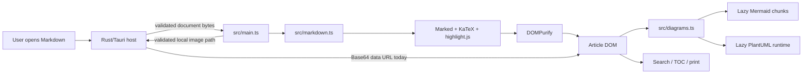

# Repository Audit Report

## 1. Audit metadata

- Repository: `C:\AI\markdown-preview-plus`
- Branch / revision: `main` / `e601f4bcee0133811571e88623ab01806225412c`
- Audit date: 2026-09-28
- Scope: kiến trúc, hiệu năng, RAM, dung lượng phân phối, dependency, bảo mật, kiểm thử, tài liệu và release readiness.
- Method: audit đọc-only theo bằng chứng trong source, lockfiles, output build hiện có và tài liệu dự án. Không chỉnh sửa source, dependency, cấu hình build hoặc generated artifacts.
- Pre-existing working-tree changes preserved: `src/styles.css` đã bị sửa và `artifacts/` chưa được track trước audit.

## 2. Executive summary

Markdown Preview Plus đã rất gọn so với phạm vi tính năng: executable hiện có khoảng **12.70 MiB**, bộ cài NSIS khoảng **5.60 MiB**, và frontend `dist/` khoảng **12.57 MiB**. Kiến trúc Tauri + system WebView2 là lựa chọn hợp lý; không có bằng chứng cho thấy đổi framework sẽ tạo ra lợi ích đủ lớn để bù chi phí và rủi ro.

Không phát hiện lỗi Critical hoặc High. Các biện pháp bảo mật quan trọng đang được áp dụng đúng: Markdown/HTML được sanitize, SVG diagram được sanitize lần nữa, URL/file access bị giới hạn, KaTeX không trust HTML, Mermaid dùng chế độ strict, và Rust host kiểm tra grant/canonical path trước khi đọc file.

Hai kết luận chính:

1. **Dung lượng phân phối gần sát mức tối ưu nếu vẫn giữ đầy đủ Mermaid và PlantUML.** Hai engine diagram chiếm **93.97% raw bytes của `dist/`**. Cắt thêm nhiều MB chỉ khả thi nếu bỏ tính năng, tạo bản Lite, hoặc nhận chi phí fork/upstream maintenance. Các tối ưu release-profile của Rust có thể giảm thêm executable nhưng cần A/B build để đo.
2. **Con số 15.5 MB RAM chưa đủ để kết luận tổng footprint.** WebView2 dùng nhiều process; cần cộng process host, renderer, GPU và utility/helper, đồng thời phân biệt Working Set với Private Bytes. Nếu 15.5 MB đã là tổng process tree ổn định thì đây là kết quả đặc biệt tốt. Nếu chỉ là process Rust host, số đó không phản ánh toàn bộ ứng dụng.

Ưu tiên thực tế nhất không phải là “vắt” thêm vài trăm KB, mà là giảm nguy cơ giật/đỉnh RAM khi mở tài liệu lớn: chuyển file I/O khỏi Tauri main thread, tránh Base64 cho ảnh, đặt budget cho ảnh/search/highlight, và làm diagram work có khả năng hủy hoặc cô lập tốt hơn.

## 3. Product understanding

Ứng dụng là Markdown reader desktop một tài liệu, read-only, chạy offline, hỗ trợ:

- GFM, heading anchors, TOC và search.
- Mermaid và PlantUML cục bộ.
- KaTeX, front matter, admonitions và syntax highlighting theo curated languages.
- Local images với native file grant.
- Print-to-PDF qua hệ thống.
- Single-instance và file association.

Các constraint quan trọng của sản phẩm là không dùng CDN/server từ xa, không cấp Markdown quyền filesystem/IPC tùy ý, không làm suy yếu sanitizer, và không mở rộng toolbar/settings nếu chưa có quyết định sản phẩm.

## 4. Architecture overview

Responsibility boundaries nhìn chung rõ:

- `src/main.ts`: window/document state, loading, image hydration, search, TOC và print.
- `src/markdown.ts`: parsing, metadata, URL policy, heading IDs, highlighting và final sanitization.
- `src/diagrams.ts`: lazy-load/render/sanitize Mermaid và PlantUML.
- `src-tauri/src/lib.rs`: native file access, path/grant/size policy, single instance và print integration.

## 5. Build and test results

### Fresh checks executed during this audit

| Check | Result | Evidence |
|---|---:|---|
| `npm run check` | Passed | TypeScript `tsc --noEmit`, wall time khoảng 0.52 s |
| `npm test` | Passed | 3 test files, 19 tests, Vitest duration 678 ms |
| `npm ls --omit=dev --depth=0` and focused trees | Passed | Không có production dependency bị thiếu/invalid trong cây được kiểm tra |

### Not run during this read-only audit

- `npm run build`
- `npm audit --omit=dev`
- Rust tests / `cargo test`
- `npm run tauri:build`
- Installer launch/smoke test
- Runtime cold-start, full process-tree RAM, diagram peak RAM và print profiling
- Linux/macOS native runtime verification

Các output hiện có được đo để hiểu footprint, nhưng không được xem là build mới của audit.

### Existing artifact measurements

| Artifact | Bytes | MiB |
|---|---:|---:|
| `dist/` | 13,183,200 | 12.572 |
| Release executable | 13,320,704 | 12.704 |
| NSIS installer | 5,874,606 | 5.602 |
| PDB, không nằm trong NSIS | 7,081,984 | 6.750 |

Không thấy source map hoặc duplicate hashed asset trong `dist/`. Executable và installer hiện có đều `NotSigned`.

## 6. Findings summary

| ID | Severity | Confidence | Finding |
|---|---|---|---|
| F-01 | Medium | Confirmed | Native document/image reads là synchronous Tauri commands và có thể chặn main thread |
| F-02 | Medium | High | Pipeline render tài liệu lớn đồng bộ, tạo nhiều bản sao chuỗi và giữ raw source lâu hơn cần thiết |
| F-03 | Medium | High | Local images đi qua Base64, tải eager, thiếu aggregate/pixel budgets |
| F-04 | Medium | High | Diagram work cũ không thật sự bị hủy; global queue có thể làm tài liệu mới chờ lâu |
| F-05 | Medium | High | Search tạo một `<mark>` cho mọi match và thao tác O(number of matches) |
| F-06 | Low | Confirmed | Empty startup vẫn eagerly load toàn bộ Markdown/KaTeX/highlight stack |
| F-07 | Low | Confirmed | Rust release profile chưa được A/B tối ưu cho binary size |
| F-08 | Medium | Confirmed | Thiếu benchmark full process-tree RAM, cold start, peak diagrams và size regression gate |
| F-09 | Low | Confirmed | Hash/size của artifacts hiện tại không khớp provenance ghi trong `VERIFICATION.md` |
| F-10 | Low | High | Một số hot paths/listener có thể giảm work và cleanup chính xác hơn |

## 7. Critical and high findings

Không có finding Critical hoặc High đã được xác nhận.

Không nên diễn giải điều này thành “không còn rủi ro”. Các finding Medium chủ yếu là availability/performance hardening: chúng có thể gây giật, tăng peak RAM hoặc làm UI chờ lâu với tài liệu/ảnh/diagram bất thường, nhưng không cho thấy arbitrary file access, remote-code loading hoặc sanitizer bypass đã được xác nhận.

## 8. Medium and low findings

### F-01 — Synchronous native reads can block the Tauri main thread

- Severity: Medium
- Confidence: Confirmed
- Category: Performance / responsiveness
- Evidence:
  - `src-tauri/src/lib.rs:43-63`: `read_document` là command đồng bộ.
  - `src-tauri/src/lib.rs:89-127`: canonicalize/open/read tài liệu tối đa 20 MiB trong command đó.
  - `src-tauri/src/lib.rs:129-136`: `read_local_image` là command đồng bộ.
  - `src-tauri/src/lib.rs:152-208`: canonicalize/open/read/signature/Base64 ảnh tối đa 5 MiB.
- Impact: Theo model của Tauri, non-async commands chạy trên main thread. I/O chậm, antivirus scan, network-mounted path hoặc file gần giới hạn có thể làm event loop native chậm và tạo cảm giác app “khựng”, dù frontend rendering tốt.
- Recommendation: Chuyển phần blocking filesystem work sang `tauri::async_runtime::spawn_blocking`; command async chỉ await kết quả. Giữ lock trong thời gian ngắn để validate/clone grant state rồi thả trước khi await.
- Acceptance criteria:
  - Không giữ `std::sync::MutexGuard` qua `.await`.
  - UI/window event loop vẫn phản hồi khi đọc file chậm gần giới hạn.
  - Tất cả path, grant và size checks hiện tại vẫn giữ nguyên.
  - Rust tests và frontend tests tiếp tục pass.

### F-02 — Large-document render is synchronous and retains avoidable data

- Severity: Medium
- Confidence: High
- Category: Performance / memory
- Evidence:
  - `src-tauri/src/lib.rs:14`: tài liệu được phép đến 20 MiB.
  - `src/main.ts:63`, `src/main.ts:293-309`: raw source được giữ trong `currentDocument` sau render.
  - `src/markdown.ts:180-185`, `src/markdown.ts:332-341`, `src/markdown.ts:370-390`: parsing/highlighting/sanitization là pipeline đồng bộ tạo HTML string rồi parse lại qua `innerHTML`.
  - Các kiểm tra sau load chỉ cần biết có document và metadata cơ bản, không cần toàn bộ source ở mọi thời điểm.
- Impact: Với file lớn, app có thể đồng thời giữ source, parser output, sanitized HTML, DOM nodes và text-node/search buffers. Curated code fences cũng highlight đồng bộ mà chưa có threshold theo block/document size.
- Recommendation:
  1. Sau khi render, chỉ giữ state tối thiểu như `hasDocument`, filename/path/grant cần thiết; giải phóng raw source nếu print/search không cần nó.
  2. Thêm fallback escaped code cho code block quá lớn hoặc khi tổng document vượt ngưỡng benchmark.
  3. Benchmark trước khi quyết định giảm giới hạn 20 MiB hoặc đưa parse vào worker; tránh refactor lớn nếu tài liệu thực tế nhỏ.
- Acceptance criteria:
  - Plain Markdown và supported syntax không đổi.
  - Large code fence không block UI vô hạn và vẫn hiển thị escaped source.
  - Peak Private Bytes giảm hoặc time-to-interactive được chứng minh tốt hơn bằng benchmark.

### F-03 — Base64 image transport inflates memory and image budgets are incomplete

- Severity: Medium
- Confidence: High
- Category: Performance / memory / availability
- Evidence:
  - `src/main.ts:341-385`: local images được resolve/hydrate ngay sau render.
  - `src/markdown.ts:323-330`: local image references trở thành placeholders.
  - `src-tauri/src/lib.rs:14-15`, `src-tauri/src/lib.rs:152-208`: mỗi ảnh tối đa 5 MiB, đọc thành byte vector rồi encode Base64.
  - Rust mutex hiện được giữ xuyên suốt phần lớn read path, nên frontend concurrency danh nghĩa không tạo bốn native reads song song; điều này giảm peak nhưng cũng serialize I/O.
- Impact:
  - Base64 tăng payload khoảng 33%, đồng thời có thể tồn tại byte buffer, Base64 string/data URL và decoded bitmap/GPU surface.
  - Giới hạn 5 MiB/file không giới hạn tổng số ảnh hoặc decoded pixel dimensions; ảnh nén nhỏ vẫn có thể decode rất lớn.
  - Eager loading mọi ảnh làm document image-heavy có peak RAM không cần thiết.
- Recommendation:
  1. Trả binary IPC response và tạo Blob URL phía frontend; revoke URL khi đổi tài liệu.
  2. Chỉ giữ native lock để validate/clone grant, sau đó thả lock trước I/O.
  3. Dùng bounded semaphore/concurrency 1–2 sau benchmark, không vô tình biến serialization thành unbounded parallelism.
  4. Lazy-load theo viewport, nhưng print phải có đường “load all then print”.
  5. Đặt aggregate decoded-pixel/byte budget và hiển thị lỗi cục bộ thay vì làm hỏng tài liệu.
- Acceptance criteria:
  - Không còn Base64/data URL cho local raster bytes.
  - Blob URLs được revoke khi document thay đổi/unload.
  - Image-heavy fixture có peak memory được đo và nằm trong budget xác định.
  - Print vẫn gồm đầy đủ ảnh sau khi chờ load.

### F-04 — Diagram jobs are not cancellable and share a global queue

- Severity: Medium
- Confidence: High
- Category: Responsiveness / memory
- Evidence:
  - `src/diagrams.ts:21-26`, `src/diagrams.ts:53-92`, `src/diagrams.ts:209-261`.
  - Generation checks ngăn kết quả cũ gắn vào DOM nhưng không dừng computation đã bắt đầu.
  - Timeout dùng `Promise.race`; underlying render có thể tiếp tục sau khi race kết thúc.
  - Mermaid/PlantUML module promises và ESM cache giữ engine đã tải cho đến hết process lifetime.
- Impact: Diagram phức tạp từ tài liệu cũ có thể giữ source/detached nodes và chiếm queue; tài liệu mới có thể chờ một job timeout đến khoảng 45 giây. Sau lần dùng đầu tiên, RAM của engine không thể kỳ vọng quay về mức empty-startup.
- Recommendation:
  - Tách queue theo engine và ưu tiên generation hiện tại.
  - Render diagram gần viewport trước; print path buộc render toàn bộ.
  - Chỉ preload PlantUML themes khi syntax thật sự cần sau khi có tests.
  - Nếu profiling chứng minh timeout/retention đáng kể, chạy PlantUML/diagram work trong disposable worker để có thể terminate và reclaim.
- Acceptance criteria:
  - Đổi tài liệu không bị chặn bởi queue của generation cũ.
  - Timeout thật sự giải phóng/cô lập work hoặc ít nhất không cản generation mới.
  - Mermaid/PlantUML fixtures và sanitized SVG security tests vẫn pass.

### F-05 — Search work scales with every match

- Severity: Medium
- Confidence: High
- Category: Performance / memory
- Evidence:
  - `src/search.ts:1-115`: normalize text, build maps và tạo `<mark>` cho mọi match.
  - `src/main.ts:109-125`: UI search integration.
  - Navigation có thể duyệt/toggle qua toàn bộ match list.
- Impact: Query ngắn phổ biến trên tài liệu lớn tạo rất nhiều DOM nodes, layout work và memory. Debounce 90 ms giảm tần suất nhưng không chặn worst case.
- Recommendation: Cap số match được materialize, báo “N+ results”; cập nhật old/current match O(1); chunk/cancel search khi query thay đổi. Giữ nguyên Unicode/normalization behavior bằng tests.
- Acceptance criteria:
  - Query worst-case không tạo DOM node không giới hạn.
  - Next/previous vẫn đúng cho phạm vi được support và UI minh bạch khi cap.
  - Existing search tests và thêm large-document regression test pass.

### F-06 — Empty startup eagerly loads the Markdown stack

- Severity: Low
- Confidence: Confirmed
- Category: Startup / memory
- Evidence:
  - `src/main.ts:5-10` statically imports Markdown functionality.
  - `src/markdown.ts:1-59` statically pulls Marked extensions, KaTeX/highlight setup và sanitizer dependencies.
  - Current main emitted JS is 484,069 raw bytes; diagram engines đã được lazy-load đúng cách.
- Impact: App khởi động empty nhưng vẫn parse/compile/evaluate Markdown stack trước khi user mở file. Lợi ích tối ưu có thể nhỏ vì WebView startup thường chiếm phần lớn hơn, nên cần đo.
- Recommendation: Dynamic import renderer on first document open, cache promise, và tùy benchmark có thể prewarm ở idle sau first paint.
- Acceptance criteria: cold-start first paint/idle Private Bytes tốt hơn mà first-open latency không tệ đáng kể.

### F-07 — Rust release profile has not been size-tuned by measurement

- Severity: Low
- Confidence: Confirmed
- Category: Packaging
- Evidence: `src-tauri/Cargo.toml` không có `[profile.release]`; executable hiện có 13,320,704 bytes.
- Impact: Binary có thể còn symbols/codegen overhead không cần trong release distribution, dù NSIS compression đã làm installer nhỏ.
- Recommendation: A/B từng thay đổi độc lập, bắt đầu với `strip = "symbols"`; sau đó thử thin/full LTO và `codegen-units = 1`. Giữ `opt-level = 3` lúc đầu để bảo vệ độ mượt. Không áp dụng mù `opt-level = "z"` hay `panic = "abort"` nếu chưa đo hiệu năng, crash behavior và diagnostics.
- Acceptance criteria: ghi lại executable/installer delta, build time, startup, document-open benchmark và crash-symbol tradeoff cho từng variant.

### F-08 — Missing full-process performance and size regression evidence

- Severity: Medium
- Confidence: Confirmed
- Category: Testing / release engineering
- Evidence:
  - `.github/workflows/desktop-build.yml:35-87` build/test nhưng chưa enforce size ledger/budget.
  - `VERIFICATION.md:53` nói rõ cold start, full process-tree memory, diagram peak và signing/notarization chưa được đo.
- Impact: Không thể xác nhận 15.5 MB là tổng RAM; size/performance regressions có thể lọt qua dù correctness tests pass.
- Recommendation:
  - CI ghi artifact sizes và cảnh báo/failed threshold theo baseline có chủ đích.
  - Manual controlled benchmark: empty cold/warm, 1 MiB plain Markdown, max supported document, image-heavy, first Mermaid, first PlantUML, sau khi thay bằng small plain document, và print preparation.
  - Ghi OS build, WebView2 version, máy, số lần chạy/median, host + descendant processes, Working Set và Private Bytes.
- Acceptance criteria: mỗi release có bảng size/RAM/cold-start có provenance và so sánh baseline.

### F-09 — Artifact provenance is stale

- Severity: Low
- Confidence: Confirmed
- Category: Release engineering
- Evidence:
  - Current installer: 5,874,606 bytes, SHA-256 `393044D7803A6A3DD3C2A54EF4CC9A7B32D36428EAF027E8608B37E5D113EEC5`.
  - Current executable SHA-256: `6E50835CAE6028D508E3055B33D2023E16D9EFDFA95AA9E268563A5411422E7F`.
  - `VERIFICATION.md:14-16` records installer 5,874,374 bytes and different hashes.
- Impact: Người review không thể nối chắc chắn artifact hiện tại với verification record. Đây không phải runtime bug nhưng làm yếu release trust.
- Recommendation: Mỗi official build cập nhật timestamp, commit, toolchain, artifact paths, sizes, hashes, signing status và exact commands; không tái sử dụng output cũ mà không ghi rõ.
- Acceptance criteria: verification record khớp byte-for-byte với artifacts được phát hành.

### F-10 — Small hot-path and listener cleanup opportunities

- Severity: Low
- Confidence: High
- Category: Performance / correctness hardening
- Evidence:
  - `src/main.ts:152-159`, `src/main.ts:219-265`: TOC active update/query/toggle nhiều nodes và resize path có repeated layout reads.
  - `src/main.ts:367-375`: cặp `load`/`error` listeners để lại listener không fire trên image vẫn sống.
  - `src/main.ts:478-486`: nếu timeout thắng, `afterprint` listener tồn tại đến khi event có thể fire về sau.
- Impact: Nhỏ ở tài liệu thường, nhưng tăng event/listener/layout work ở tài liệu dài hoặc nhiều ảnh.
- Recommendation: track old/current TOC link, cache bounds trong một frame/requestAnimationFrame, và cleanup listener đối ứng khi một branch hoàn tất.
- Acceptance criteria: behavior không đổi; listener-count/layout profile giảm trong stress fixture.

## 9. Dead, unused, duplicate, and redundant code/assets

Không xác nhận production dependency nào hoàn toàn unused.

Các điểm dễ bị hiểu nhầm nhưng không nên xóa mù:

- Hai KaTeX versions: app/`marked-katex-extension` dùng 0.18.9; Mermaid kéo 0.16.47 theo range của chính nó. Force override có thể nằm ngoài support range và chỉ tiết kiệm khoảng vài chục KB compressed.
- Mermaid có nested `marked` 16.4.2 trong khi app dùng 18; đây là dependency graph của upstream, không phải bằng chứng app import trùng vô ích.
- 20 KaTeX source fonts đều có reference; 19 file được emit, một font được inline. Không có font rõ ràng an toàn để xóa.
- PlantUML `public/`, package source và build cache có duplication trong workspace, nhưng chỉ output được bundle mới nằm trong installer.
- Mobile/Store icons khoảng 110 KB trong repo không nằm trong current desktop installer và có thể cần cho packaging tương lai.
- `crate-type` tạo thêm build outputs trong target directory nhưng không đồng nghĩa chúng được ship trong NSIS.

Generated/build-only directories rất lớn nhưng không ảnh hưởng kích thước cài đặt:

- `src-tauri/target/`: khoảng 4.97 GiB.
- `.tools/`: khoảng 2.20 GiB.
- `node_modules/`: khoảng 350 MiB.

Chúng chỉ là cơ hội dọn workspace/cache có kiểm soát, không phải tối ưu sản phẩm. Không xóa trong audit này.

## 10. Security analysis

### Positive controls

- Final HTML đi qua DOMPurify.
- Diagram SVG được sanitize riêng trước khi insert.
- Mermaid strict security mode; KaTeX `trust: false`, strict/bounded options.
- Raw HTML/user-controlled KaTeX HTML extensions không được mở.
- URL/image policies hẹp; không có CDN, remote grammar/font/theme hoặc PlantUML server.
- Rust host canonicalizes path, kiểm tra grants, type/signature và file-size limits.
- Tauri capabilities hẹp; Markdown không được cấp arbitrary filesystem/IPC access.
- YAML/front matter errors là local failure, không nuốt phần tài liệu theo sau.

### Residual risks

- Large decoded images, match explosion, large highlighting và long-running diagrams là availability/performance risks.
- Artifacts hiện tại không signed; đây là release trust/distribution issue, không phải bằng chứng code execution vulnerability.
- `npm audit --omit=dev` không được chạy mới trong audit này; tài liệu dự án ghi lần chạy trước không có vulnerability nhưng không được coi là fresh evidence.

Không khuyến nghị bỏ sanitizer, nới capability/path allowlist hoặc dùng remote renderer để giảm bundle. Những thay đổi đó đánh đổi security/offline guarantees lấy lợi ích không tương xứng.

## 11. Performance and resource analysis

### 11.1 Distribution byte budget

| Group | Files | Raw bytes | MiB | % of `dist/` | gzip-9 proxy | Brotli-6 proxy |
|---|---:|---:|---:|---:|---:|---:|
| PlantUML core + static assets | 6 | 7,302,918 | 6.96 | 55.40% | 2,278,705 | 2,041,924 |
| Mermaid emitted JS | 98 | 5,084,326 | 4.85 | 38.57% | 1,461,754 | 1,335,200 |
| Eager app JS | 1 | 484,069 | 0.462 | 3.67% | 147,411 | 138,373 |
| KaTeX emitted fonts | 19 | 256,168 | 0.244 | 1.94% | 256,635 | 256,191 |
| CSS | 1 | 47,598 | 0.045 | 0.36% | 12,517 | 11,631 |
| HTML | 1 | 8,121 | 0.008 | 0.06% | 2,199 | 1,973 |
| **Total** | **126** | **13,183,200** | **12.57** | **100%** | **4,159,221** | **3,785,292** |

Compression columns là per-file in-memory proxies, không phải dự đoán chính xác NSIS.

PlantUML + Mermaid chiếm **93.97%** raw `dist/`. Cả hai đang lazy ở empty startup. Mermaid được code-split nhiều chunks; first Mermaid render không nhất thiết nạp toàn bộ 5.08 MiB. First PlantUML render hiện nạp core, `viz-global` và themes khoảng 5.37 MiB raw; emoji/openiconic chỉ tải khi cần. `themes.js` khoảng 326 KB raw là ứng viên lazy-on-syntax sau khi có coverage.

### 11.2 Size tradeoffs

| Option | Approx. raw `dist/` avoided | Cost |
|---|---:|---|
| Bỏ PlantUML | 6.96 MiB | Mất core feature; phải đo actual EXE/NSIS delta |
| Bỏ Mermaid | 4.85 MiB | Mất core feature |
| Bỏ PlantUML emoji support | ~1.79 MiB | Break supported syntax/docs |
| Bỏ/fork Mermaid ELK layout | ≥1.39 MiB | Mất layout hoặc gánh fork/custom maintenance |
| Force KaTeX dedupe | Chỉ khoảng ~70 KB compressed | Unsupported version override risk |

Kết luận: không nên hy sinh các tính năng này trong bản đầy đủ. Nếu product thật sự cần “siêu tối giản”, nên định nghĩa **Lite edition** có feature matrix rõ và đo installer thực tế, thay vì xóa ngầm syntax đang support.

### 11.3 RAM methodology

WebView2 có browser, renderer, GPU và utility/helper processes. Đo một process trong Task Manager có thể bỏ sót phần lớn footprint. Benchmark nên:

1. Khởi động cold và warm, chờ state ổn định.
2. Gom root executable cùng toàn bộ descendant WebView2 processes thuộc instance.
3. Ghi cả Working Set và Private Bytes; summed Working Set có thể double-count shared pages.
4. Ghi GPU memory riêng nếu công cụ cung cấp.
5. Chạy nhiều lần và báo median/range.
6. Đo các scenario: empty, plain 1 MiB, max document, image-heavy, first Mermaid, first PlantUML, replace bằng small plain doc, print preparation.

Không nên tắt GPU acceleration để cố hạ một chỉ số RAM: điều đó thường đổi memory category và có thể làm scrolling/rendering kém mượt. Mục tiêu nên là tổng responsiveness, peak và retained memory sau workload.

### 11.4 Smoothness priorities

Theo thứ tự lợi ích/rủi ro:

1. Move native filesystem work off main thread.
2. Binary image IPC + Blob URL + explicit revoke/budgets.
3. Search/highlight caps cho worst case.
4. Cancellable/isolated diagram work và viewport scheduling.
5. Lazy-load Markdown stack ở empty startup nếu benchmark chứng minh lợi ích.
6. Micro-optimize TOC/layout/listener paths sau profiling.

## 12. Testing analysis

Điểm mạnh:

- Fresh frontend suite: 19/19 tests pass.
- Tests tập trung đúng chỗ nhạy cảm: URL/security policy, rich-content parsing, malformed/local failure và read queue.
- Rust source có unit tests và CI có native matrix theo tài liệu/workflow hiện tại.

Khoảng trống:

- Không có automated UI/performance test cho tài liệu lớn, match explosion, image-heavy và diagram timeout/cancellation.
- Không có process-tree RAM/cold-start benchmark.
- Không có regression budget cho `dist`, executable và installer.
- Native open/drop/file association, second instance, print, Linux/macOS runtime chưa được verify mới trong audit này.
- Rust tests không được chạy mới trong audit này.

Test additions nên theo từng fix, không tạo framework lớn trước nhu cầu. Ưu tiên fixture có upper bounds và deterministic unit/integration tests; performance baselines nên có tolerance theo môi trường.

## 13. Documentation analysis

README, PLAN và VERIFICATION có chất lượng tốt, giải thích rõ supported syntax, offline/security constraints, dependency evidence và phần platform work chưa verify. Đây là điểm mạnh hiếm thấy ở app nhỏ.

Cần cập nhật khi thực hiện tối ưu:

- `README.md`: chỉ khi user-facing syntax/limits thay đổi.
- `PLAN.md`: architecture changes như worker, image transport hoặc Lite edition.
- `VERIFICATION.md`: exact commands, commit/toolchain, sizes/hashes, process-tree memory và platform status.

Artifact provenance hiện tại cần refresh vì current files không khớp hashes/sizes đã ghi.

## 14. Build, packaging, dependencies, and release analysis

- Tauri app chỉ có một window, dùng system WebView và không ship browser runtime riêng.
- NSIS compression hoạt động tốt: 12.57 MiB raw frontend + native binary trở thành installer 5.60 MiB.
- Không có external binary/resources thừa rõ ràng trong current bundle.
- Diagram engines đã được lazy/code-split; không có source maps trong release output.
- Exact package versions/lockfiles hỗ trợ reproducibility.
- Tauri/Cargo dependency tree có compression libraries theo default features; không nên tắt mù vì có thể tăng installer hoặc phá behavior.
- Release artifacts chưa signed. Nếu phân phối công khai, code signing là ưu tiên trust/UX dù có thể thêm một ít metadata và quy trình.

## 15. Positive observations

- Scope sản phẩm kỷ luật; không có telemetry/CDN/settings creep.
- Chọn Tauri + system WebView phù hợp mục tiêu footprint.
- Mermaid/PlantUML lazy-load thay vì đẩy 12+ MiB JS vào empty startup.
- Sanitization và native file boundary được thiết kế nhiều lớp.
- Local failures không làm mất phần Markdown theo sau.
- CSS không dùng blur/continuous animation nặng và có reduced-motion consideration.
- Không thấy interval/background loop vô hạn.
- Bundle không chứa source maps hay duplicate hashed assets.
- Current installer 5.60 MiB là rất cạnh tranh cho app hỗ trợ cả hai diagram engines, math, highlighting và native integration.

## 16. Prioritized remediation roadmap

### Immediate: measure before changing product behavior

1. Thiết lập full process-tree RAM/cold-start benchmark và artifact size ledger.
2. Refresh artifact provenance/hashes; ghi rõ unsigned status.
3. A/B Rust `strip = "symbols"` trên một branch/build thử nghiệm.

### Short term: highest responsiveness return

1. Refactor native reads sang async command + `spawn_blocking`, thả lock trước I/O.
2. Đổi local image transport từ Base64 sang bytes/Blob URL, cleanup URL, thêm aggregate/pixel budgets.
3. Cap search matches và large-code-block highlighting; thêm stress tests.

### Medium term: peak/retention work

1. Diagram scheduling theo generation/viewport; tách engine queues.
2. Chỉ tải PlantUML theme resources khi syntax cần.
3. Nếu measurements cho thấy vấn đề, dùng disposable worker cho diagram rendering.
4. Lazy-import Markdown stack nếu cold-start benchmark cho thấy improvement có ý nghĩa.

### Optional product decision

Tạo Lite edition không Mermaid/PlantUML hoặc chỉ một engine. Đây là cách duy nhất có khả năng giảm nhiều MB nữa, nhưng phải là SKU/feature decision rõ ràng, không phải “optimization” vô hình.

## 17. Human verification checklist

- [ ] Đo process tree trên Windows với WebView2 version và OS build ghi rõ.
- [ ] Cold start/warm start ít nhất 5 lần; báo median/range.
- [ ] Empty document: Working Set, Private Bytes, GPU memory.
- [ ] Plain Markdown 1 MiB và file gần limit 20 MiB.
- [ ] Search worst-case với query một ký tự/phổ biến.
- [ ] Image-heavy document, ảnh kích thước nén nhỏ nhưng pixel dimensions lớn.
- [ ] First Mermaid và first PlantUML; sau đó thay bằng small plain doc và đo retained memory.
- [ ] Diagram malformed/timeout rồi đổi document ngay.
- [ ] Print preparation với images/diagrams đã load đủ.
- [ ] Network log vẫn rỗng trong rendering.
- [ ] Verify exact executable/installer hashes, signatures và launch smoke.
- [ ] Run native build/runtime checks trên từng target OS được phát hành.

## 18. Limitations

- Audit không rebuild output để tránh ghi đè generated artifacts và giữ đúng chế độ read-only.
- Existing `dist/`, executable và installer có thể không cùng provenance với revision hiện tại; measurements chỉ mô tả files đang có.
- Không có app instance đang chạy thuộc repository để đo RAM; các WebView2 processes quan sát được thuộc ứng dụng khác.
- Không chạy `npm audit`, Rust tests, native build, installer smoke hoặc cross-platform runtime.
- Compression estimates theo gzip/Brotli chỉ để phân bổ tương đối; actual NSIS delta phải đo bằng rebuild A/B.
- Line references dựa trên working tree tại thời điểm audit, trong đó `src/styles.css` đã có thay đổi của user.

## Final verdict

| Goal | Verdict |
|---|---|
| Installer/disk size | **Đã rất tối ưu.** 5.60 MiB là xuất sắc; multi-MB savings còn lại chủ yếu đòi hỏi bỏ diagram features hoặc Lite edition. |
| Idle RAM | **Chưa đủ bằng chứng.** 15.5 MB có thể chỉ là host process; cần full WebView2 process-tree measurement. |
| Peak RAM | **Còn dư địa rõ.** Base64 images, decoded pixels, large-document string/DOM copies, search marks và retained diagram engines là các mục tiêu chính. |
| Smoothness | **Tốt ở workload thường, nhưng worst-case có rủi ro.** Synchronous native I/O và unbounded/high-cost render paths nên được ưu tiên. |
| Security/offline posture | **Mạnh.** Không nên đánh đổi sanitizer, local-only rendering hoặc file boundaries để lấy size nhỏ hơn. |
| Overall | **Production-oriented và lean; chưa thể gọi là “tối ưu nhất có thể” cho workload cực đoan cho đến khi có đo process-tree và peak profiling.** |
