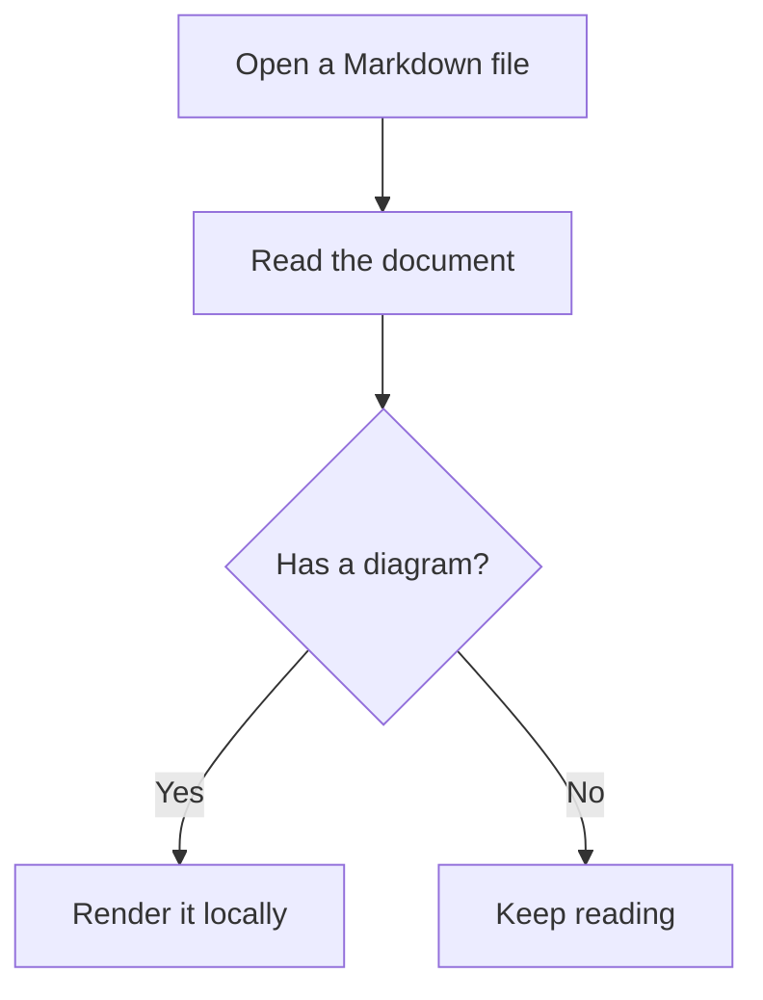
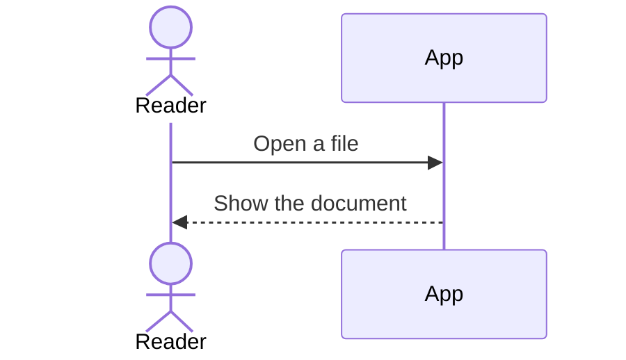
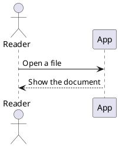
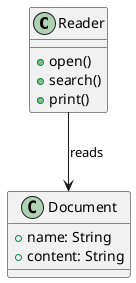

# A quiet reading example

Markdown Preview Plus keeps the document itself in view. The reader supports **bold text**, *emphasis*, inline `code`, links, and ordinary Unicode like Tiếng Việt, café, and 東京. The front matter above is parsed as metadata and is not displayed as article content.

Search for the word **needle** to try the in-file search. A second needle appears here, and the last needle is in a code block below.

## A small table

| Format | Purpose | Included |
|:--|:--|:--:|
| Markdown | Readable notes | Yes |
| Math | Offline KaTeX | Yes |
| Callouts | Note, tip, warning, danger | Yes |
| Mermaid | Flow and sequence diagrams | Yes |
| PlantUML | UML diagrams | Yes |

## Math

Inline math uses single-dollar delimiters, such as $x^2 + y^2 = z^2$.

Block math uses double-dollar delimiters:

$$
\int_0^1 x^2 \, dx = \frac{1}{3}
$$

This intentionally unsafe command stays visible as a local KaTeX error: $\htmlClass{unsafe}{x}$.

## Callouts

:::note
Search still sees this note text.
:::

:::tip
Tip content is parsed as normal Markdown.
:::

:::warning
Warnings use the existing theme tokens.
:::

:::danger
Danger content stays inside the article.
:::

:::future
Unknown callout types show their original source as a visible fallback.
:::

## A local image

This picture is loaded from a relative raster file beside the Markdown document.


## Mermaid flow



## Mermaid sequence



## PlantUML sequence



## PlantUML class diagram



## A contained diagram error

```mermaid
flowchart TD
    Start -->
```

This paragraph remains readable even if the diagram above has a syntax error.

## Code and links

```bash
printf 'offline\n'
```

```css
.article { color: var(--ink); }
```

```javascript
const lastNeedle = 'needle';
```

```typescript
const count: number = 3;
```

```json
{"offline": true}
```

```markdown
**local** Markdown
```

```python
print("offline")
```

```rust
fn main() { println!("offline"); }
```

```yaml
offline: true
```

```xml
<reader mode="offline" />
```

```ts
const lastNeedle = 'needle';
```

External links open only when selected: [Tauri](https://tauri.app/).
